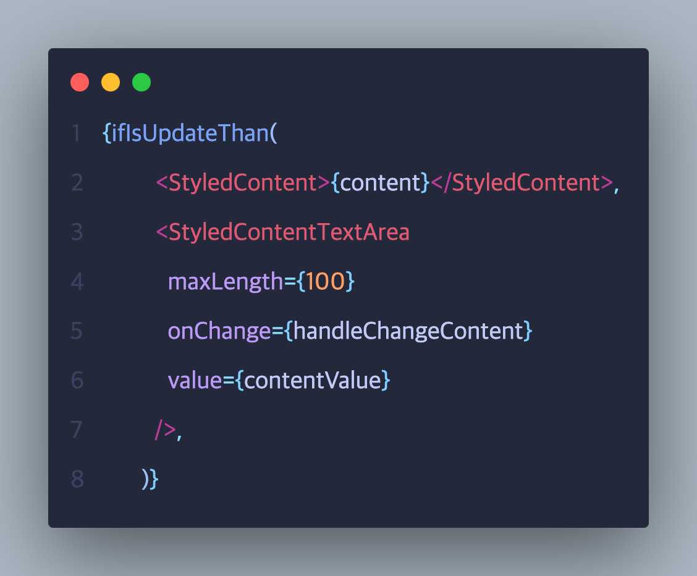
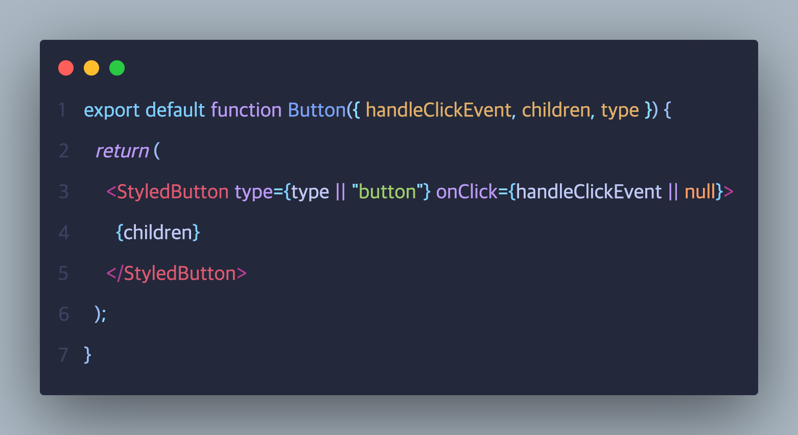
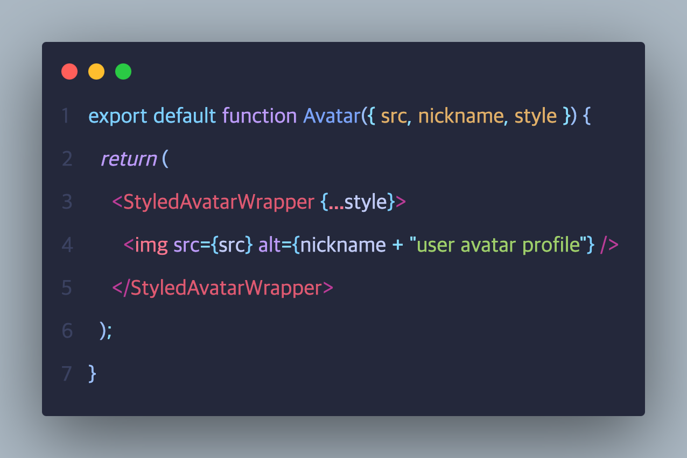
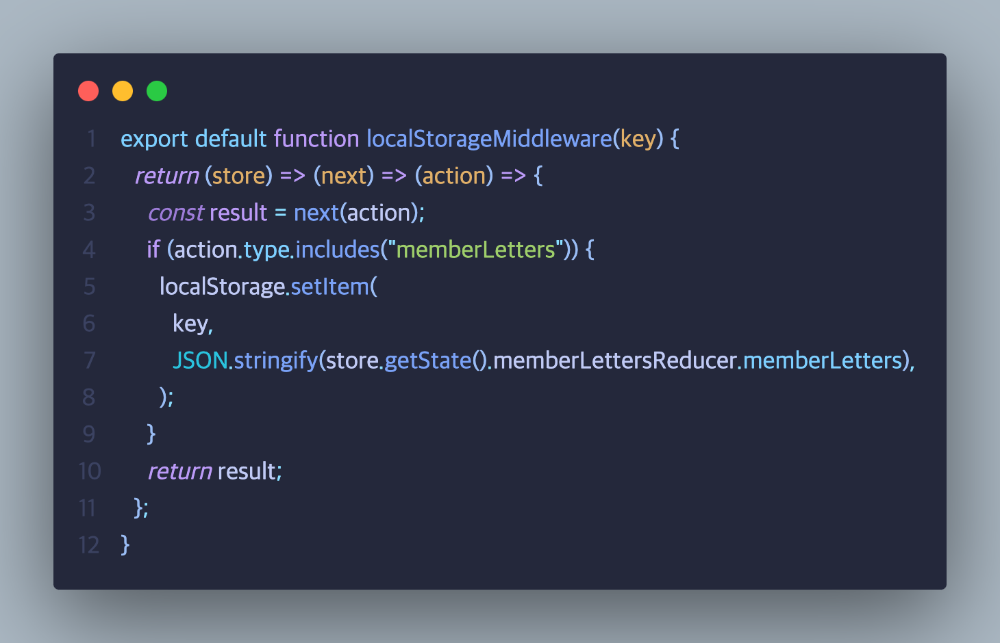
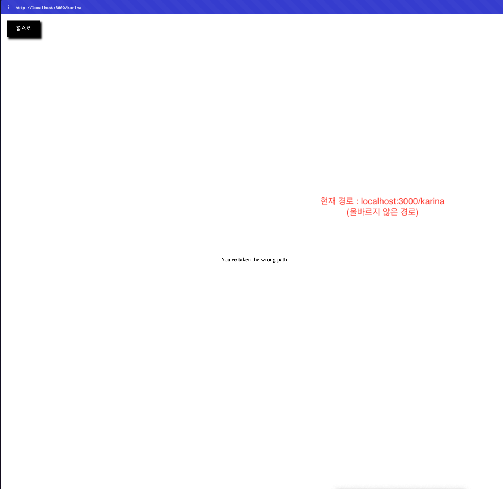
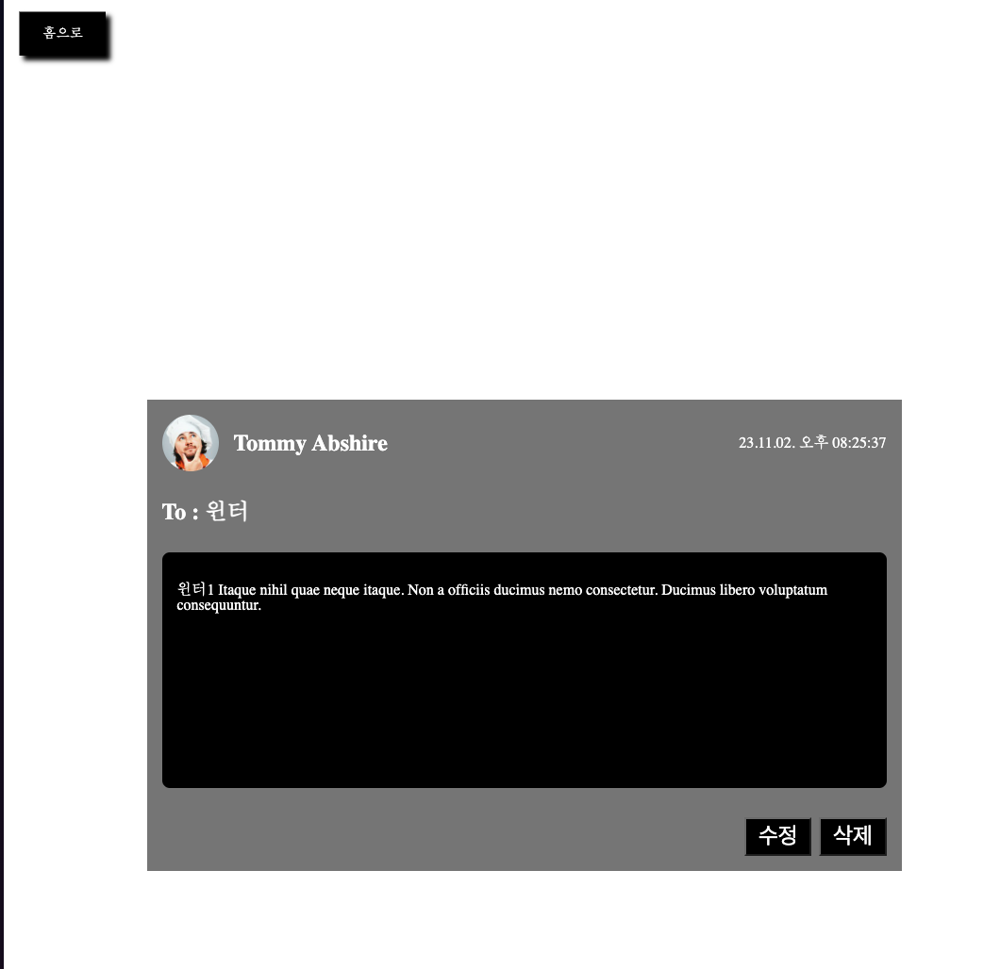

# 내일 배움 캠프 개인 과제 : 팬 래터 홈페이지

리액트로 만든 걸그룹 에스파 팬 레터함

# 주요 기능

- react-router-dom을 이용한 SPA (Home, Detail)
- Home 페이지 : 각 멤버별 응원 메시지 작성, 간단한 팬래터 확인 가능
- Detail 페이지 : 각 팬레터 내용을 수정 및 삭제할 수 있는 페이지

# 구현 사항

- Props driling, Context API, Redux를 이용한 각각의 전역 상태 관리
- 팬래터 CRUD 구현 (작성, 조회, 수정, 삭제)
  - 아티스트 별 게시물 조회 기능 구현
    - 팬래터가 없을 경우 비어있는 팬래터라고 표시
  - 팬레터 상세 화면 구현
  - 팬래터 내용 수정 구현
    - 업데이트 된 내용이 없다면 alert창이 뜨면서 수정이 안됨
  - 팬래터 삭제 구현
    - 삭제 시 바로 삭제가 아닌 confirm을 통해서 삭제를 되도록 구현
- styled-components를 이용한 스타일링
- 올바르지 않은 경로로 접근 시 에러 페이지 노출

# 구현 시 고려 사항

- 삼항 연산자 대신 함수 사용으로 가독성 향상 의도
  
- 공통 버튼, 공통 아바타를 통한 재사용성 향상 의도

  - 랜더 속성값을 이용한 컴포넌트 가독성 향상 의도
    
    

- 컨테이너 컴포넌트, 프레젠테이션 컴포넌트 분리
- 멤버 팬래터 값이 변할 경우 로컬 스토리지에 자동 저장될 수 있도록 미들웨어 적용
  
- 올바르지 않은 경로로 접근 시 에러 페이지 노출
  

# 페이지 스크린샷

